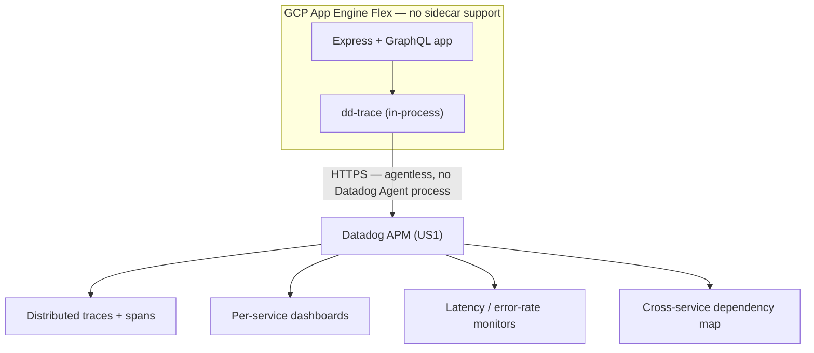

# APM Enablement — GCP App Engine (Datadog dd-trace)

End-to-end application performance monitoring for four production Node.js services running on GCP App Engine Flex — distributed tracing, latency/error/throughput metrics, and a live service map, rolled out with zero prior tracing infrastructure to build on.

Client: First Dollar. Ticket: HORIZON-11017.

## The problem

Four backend services (API, Consumer, Manager, Admin) had error logging (Sentry) but no performance visibility at all:

- No trace IDs, no request spans.
- No way to see where time is spent inside a request.
- No way to identify which DB query or downstream call is the bottleneck.
- No p95/p99 latency per endpoint or per GraphQL resolver.

## The constraint

**App Engine Flex does not support sidecar containers**, which rules out the standard Datadog Agent deployment pattern (agent-as-sidecar). Three options were evaluated:

| Option | Approach | Verdict |
|---|---|---|
| A | Datadog `dd-trace` in agentless mode | ✅ Chosen |
| B | OpenTelemetry → Datadog via OTLP | Considered — more portable, more setup, no standardization decision made yet |
| C | GCP Cloud Trace | ❌ Eliminated — diverges from the org's Datadog-first observability strategy |

`dd-trace` agentless won because it auto-instruments the exact stack in use (Express routes, GraphQL resolvers, the Postgres client, outbound HTTP to Plaid/Stripe/Twilio) with a single `tracer.init()` call, sends traces directly over HTTPS with no agent process required, and the team was already committed to Datadog (API key already provisioned, Postgres monitoring already live).

## Architecture



## What changed in the codebase

**Entry point** — must be the first import, before Express or anything else initializes:

```typescript
import tracer from 'dd-trace';
tracer.init();
```

**Per-service, per-environment config** (non-secret identifiers only):

```yaml
env_variables:
  DD_SERVICE: fd-backend-admin
  DD_ENV: dev
  DD_VERSION: "{{ git SHA }}"
  DD_SITE: datadoghq.com
  DD_TRACE_ENABLED: "true"
```

**Secret handling** — `DD_API_KEY` never touches the app config file. It lives in GCP Secret Manager and is injected at deploy time via CI, scoped per environment:

```yaml
- name: Inject DD_API_KEY
  run: echo "  DD_API_KEY: ${{ secrets.DATADOG_API_KEY }}" >> app.yaml
```

Monitors and dashboards are defined as code in a separate observability repo and deployed via the same PR-based CI pattern already used for database monitoring — no click-ops in the Datadog UI.

## Rollout strategy

| Stage | Service | Why |
|---|---|---|
| Pilot | Admin (lowest traffic, ~184K req/mo) | Lowest blast radius to validate traces/spans/metrics land correctly |
| Roll out | Consumer → Manager → API | Increasing order of traffic and complexity |
| Monitor | All 4 services, across all 7 environments | Dashboards + alerting live everywhere |

## Result

Before: no visibility beyond error logs. After:

- Distributed traces for every inbound request, across all 4 services.
- GraphQL operation names as span names — slow queries are identifiable by name, not guesswork.
- DB query spans (query text, duration, connection pool).
- Outbound HTTP spans for third-party calls (Plaid, Stripe, Twilio).
- p95/p99 latency and error rate per endpoint per service, with alerting on regressions.
- A visual service dependency map across all 4 apps.

## Key decisions

- **`dd-trace` over OpenTelemetry** — the org was already Datadog-committed with a working API key and existing Postgres monitoring; `dd-trace` auto-instruments the exact stack with minimal code. OTel would be the right call if/when the org standardizes on OTel-everywhere across metrics *and* traces — that decision hadn't been made yet.
- **Agentless over a Lambda/serverless forwarder** — agentless is simpler and sufficient; the forwarder pattern adds complexity the use case didn't need.
- **Secrets never in the app config file** — followed the org's established pattern: credentials live in Secret Manager, injected at deploy time by CI; only non-secret identifiers go in the checked-in config.
- **Lowest-traffic service first** — validated the entire pipeline (init → traces → dashboard → alert) on the service with the least blast radius before touching anything higher-traffic.

## Repo layout

| File | Purpose |
|---|---|
| `src/tracing.ts` | The `dd-trace` init module, imported first in each service's entry point. |
| `config/app.admin.dev.yaml`, `config/app.admin.prod.yaml` | Example App Engine config per environment — non-secret Datadog identifiers only. |
| `ci/deploy.yml` | Illustrative GitHub Actions deploy workflow showing secret injection from GCP Secret Manager at deploy time. |
| `datadog/monitors.json` | Monitors-as-code: p95 latency, error rate, and throughput-anomaly alerts. |
| `datadog/dashboards.json` | Dashboard-as-code: latency, error rate, throughput, and service map widgets. |
| `package.json` | Dependency + start-script fragment showing how the tracer is loaded before the app. |

Config values, service names, and monitor thresholds here are illustrative examples reflecting the real pattern used in production — not a copy of the client's proprietary source.

## Stack

Node.js on GCP App Engine Flex · Express + GraphQL · Datadog `dd-trace` v5 (agentless) · Datadog APM (US1) · GCP Secret Manager · GitHub Actions
