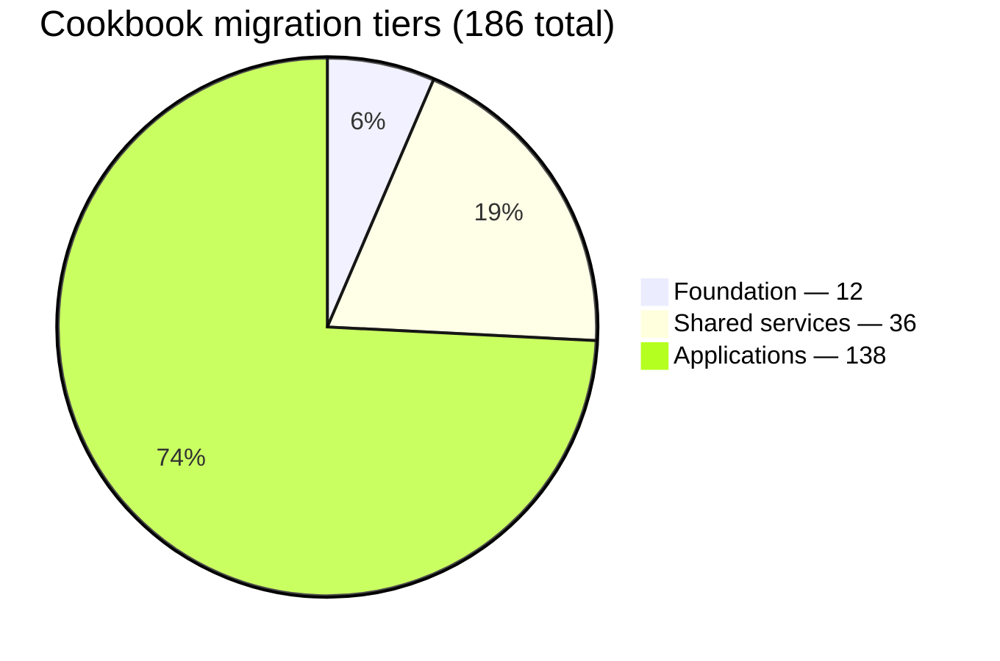
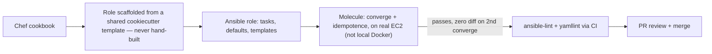

# Chef → Ansible Migration — HPC Estate Re-platform

An in-progress full re-platform of a large HPC compute estate from Chef to Ansible (target: Ansible Automation Platform), for the Eli Lilly HPC team. Not a lift-and-shift — every Chef cookbook is redesigned as an Ansible role and validated with Molecule against real EC2 instances, replacing Chef Test Kitchen.

## Scope, verified by a full scan of the Chef estate

| Metric | Count |
|---|---|
| Role files (server groups) | 161 |
| Unique cookbooks | 186 |
| Recipe references across all roles | 2,328 |
| OS split | RHEL 9 (majority), RHEL 8, one legacy RHEL 7 |

References outnumber unique cookbooks because a single cookbook (e.g. a base RPM-repo setup) can be pulled into dozens of roles — roles are layered, stacking specific configuration on top of shared base roles.

## Migration order — sequenced by reuse, not size

Converting the most-reused cookbooks first means every later conversion can build on already-validated, already-converted dependencies instead of re-solving the same problems repeatedly.

| Tier | Count | What's in it |
|---|---|---|
| Foundation | 12 | Present in nearly every server (one foundation cookbook alone appears in 323 roles). Converted first — everything else depends on these. |
| Shared services | 36 | Schedulers (UGE, Slurm), monitoring (Nagios, Splunk), language/compiler runtimes, environment modules, GPU drivers. |
| Applications | 138 | Long-tail, single-purpose, low reuse. Order-independent — the parallelizable bulk of the work across the team. |

## Conversion pipeline

Idempotence is a hard gate: running `molecule converge` twice must show zero changes on the second run. The cookiecutter template's default test sequence omits the idempotence check by default — it's added back manually for every role per the team's testing standard.

## Status (only entries below are real conversions — nothing else should be treated as done)

| Cookbook | Status | Notes |
|---|---|---|
| nginx | Analyzed, pilot converted | First end-to-end pilot, used to validate the whole conversion process before scaling it to the team. |
| Splunk OTel Collector | In progress | Live in-progress conversion; currently the reference example for team conventions. Not yet merged. |
| pandoc | Scaffold only, not a real conversion | Generated from the cookiecutter template purely to prove the AWS/SSH/Molecule toolchain works end to end — contains only generic starter tasks, no actual pandoc logic. |

## Chef → Ansible concept mapping

| Chef | Ansible |
|---|---|
| Cookbook | Role |
| Recipe (Ruby) | Tasks file (YAML) |
| Attributes | `defaults/main.yml` + `host_vars` |
| Ruby logic in attributes | Jinja2 inside `set_fact` |
| ERB template | Jinja2 (`.j2`) template |
| Roles / run_list | Inventory groups + playbook |
| Test Kitchen + InSpec | Molecule on real EC2 |
| cookstyle | `ansible-lint` + `yamllint` |

## Conventions established (from real conversion work, not assumptions)

- **Never hand-build role scaffolding** — always start from the shared internal cookiecutter template.
- **Traceability** — every task file is annotated with the exact Chef recipe it replaces (e.g. `# Mirrors: recipes/default.rb`), so reviewers can diff behavior against the original.
- **Ruby attribute logic becomes Jinja2 inside `set_fact`** rather than being hand-translated into imperative Ansible logic.
- **Secrets go into Ansible Vault, never plaintext** — this isn't theoretical: a real plaintext token was found and flagged during the testing-standard work, which is why this rule is enforced rather than assumed.
- **Fully-qualified module names** (`ansible.builtin.*`, `amazon.aws.*`, etc.) throughout.
- **Linting runs in CI, not inside `molecule test`** — current Molecule versions dropped native lint from the test sequence, so it's a separate GitHub Actions job.
- **Testing infrastructure is shared and standardized**, not per-role: a common AWS test account/region, a shared SSH key pair stored in team secrets storage (never per-user), and a fixed family of internal base AMIs (standard RHEL 9, GPU-enabled, and early-bootstrap variants) so every role is tested against the same baseline image.

## Open decisions (not yet settled)

- Molecule verifier: native Ansible assertions vs. InSpec, as the team default.
- What replaces Chef's 30-minute self-heal / drift-correction loop post-migration — no direct equivalent decided yet.
- Whether to keep supporting both UGE and Slurm long-term or consolidate on one scheduler.
- Approved instance types and budget ceiling for GPU/high-memory Molecule test runs.

## Repo layout — the nginx pilot as a worked example

| File | Purpose |
|---|---|
| `examples/before-chef-recipe.rb` | The generic Chef pattern being replaced (illustrative reconstruction, not client source). |
| `roles/nginx/tasks/main.yml` | Converted tasks, each annotated with the Chef recipe it mirrors. |
| `roles/nginx/defaults/main.yml` | Converted from Chef attributes. |
| `roles/nginx/handlers/main.yml` | Converted from the Chef `notifies` pattern. |
| `roles/nginx/templates/nginx.conf.j2` | Converted from the ERB template — same structure, Jinja2 syntax. |
| `roles/nginx/meta/main.yml` | Role metadata (platforms, min Ansible version). |
| `molecule/default/molecule.yml` | Shared EC2 driver config — real account/subnet/security-group IDs come from environment variables, never hardcoded. |
| `molecule/default/converge.yml`, `verify.yml` | Molecule provisioning and verification playbooks. |
| `ci/lint.yml` | `ansible-lint` + `yamllint`, run in CI rather than inside `molecule test`. |

Role code, config values, and infrastructure identifiers here are illustrative — modeled on the real nginx pilot conversion, with internal AWS account details, key names, and repo URLs generalized since this is a public repo.

## Stack

Ansible + Ansible Automation Platform (target) · Molecule (EC2 driver) · Cookiecutter role scaffolding · `ansible-lint` / `yamllint` · GitHub Actions · Ansible Vault
